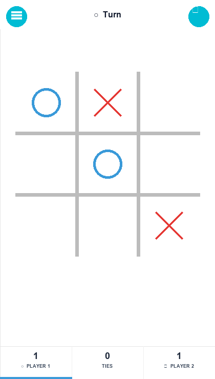
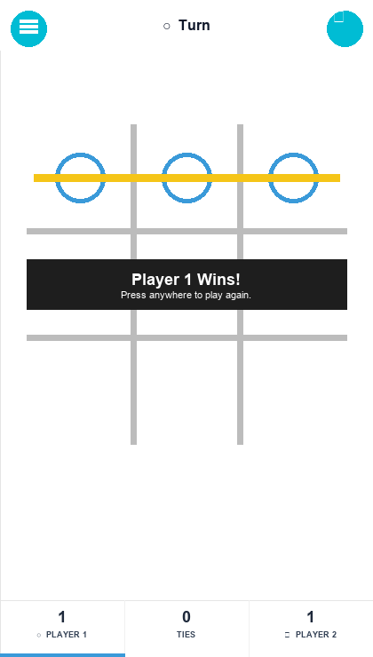
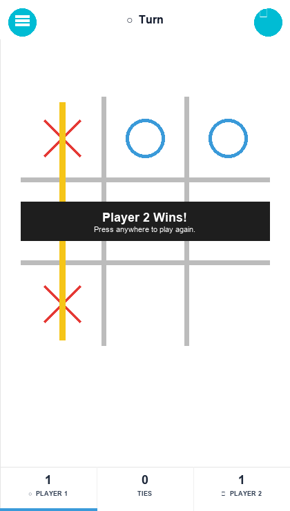
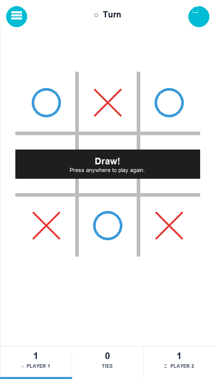

# OXO — Tic Tac Toe

Clean, fast, mobile-first Tic Tac Toe built with Next.js. Player 1 = **O** (blue), Player 2 / BOT = **X** (red). `O` goes first and its indicator stays.

**Live:** <a href="https://faizan.is-a.dev/oxo-game/">Live</a> ·
**Repo:** <a href="https://github.com/faizan-2005/oxo-game">Repo</a>

## Screenshots

| Game | Win (Player 1 — O) | Loss (Player 2 — X) | Draw |
|---|---|---|---|
|  |  |  |  |

## Features

- **Two modes:** One Player vs BOT (hard AI: win → block → center → corner → side) and Two Players (pass & play)
- **BOT always second** — YOU (O) starts every game in 1P
- **OXO theme:** teal `#00bcd4`, blue `#3a9ad9` (O), red `#e53935` (X), yellow `#f5c518` win line, gray `#bcbcbc` grid
- **Full-screen menus:** Main / Menu (≡) / Settings (gearbox) — minimal 2-button layout, same grid bg
- **Live repo stars:** `Star this repo` shows `faizan-2005/oxo-game` stars via GitHub API
- **Sound + toggle**, scoreboard (O / Ties / X), win banner, draw shake animation
- **Fully responsive:** `100dvh`, `min(92vw,56vh)` board, `max-w-[420px]` card, rounded on desktop
- **Icons:** real GitHub + star + gearbox + speaker SVGs, no emoji
- **Favicon:** `src/app/icon.png` / `favicon.ico` — O + X on white

## How to Play

- Player 1 is **O**, Player 2 / BOT is **X**. First to get 3 in a row (row/col/diag) wins — yellow line appears.
- Tap any cell to place your mark. Press anywhere after Win/Draw to reset.
- Bottom bar shows `PLAYER 1 (O) | TIES | PLAYER 2 (X)` — blue bar stays under who drew first.

## Tech Stack

Next.js 16 (App Router, Turbopack), React 19, Tailwind CSS 4, TypeScript.

## Getting Started

```bash
npm install
npm run dev
# open http://localhost:3000
```

Build:

```bash
npm run build
# out/ folder
```

## Project Structure

```
src/app/page.tsx      # game + menus + board
src/lib/game.ts       # win/draw logic
src/app/icon.png      # favicon (O+X)
public/screenshots/   # game.png, win.png, loss.png, draw.png
```

## Credits

- Author: **Faizan Baig**
- Star the repo: <a href="https://github.com/faizan-2005/oxo-game">https://github.com/faizan-2005/oxo-game</a>
